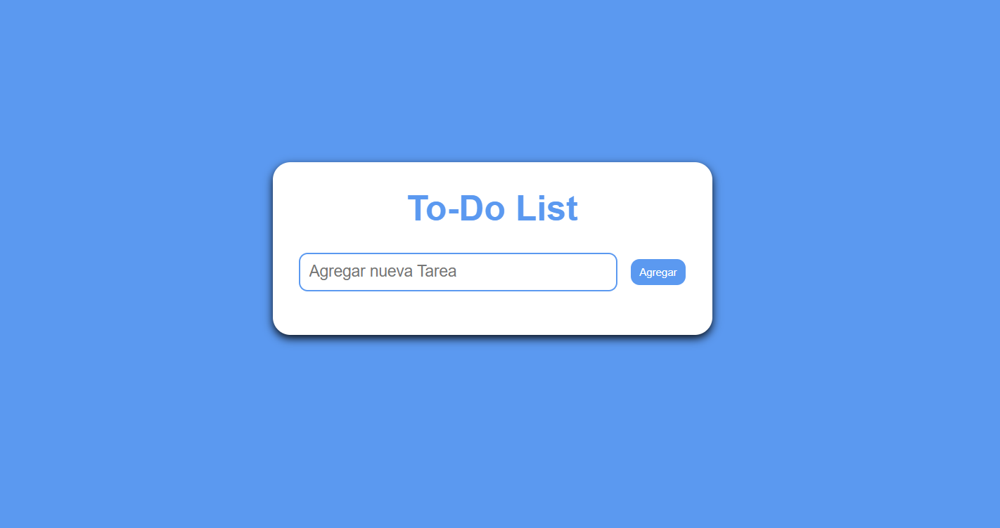

# 📝 Task List - Lista de Tareas

Una pequeña aplicación web que permite a los usuarios:

✅ Agregar tareas  
✅ Editar tareas  
✅ Eliminar tareas  
✅ Guardar las tareas automáticamente en el navegador usando `localStorage`  
✅ Mantener las tareas incluso después de recargar la página  

## 📸 Vista previa

 

## 🚀 Tecnologías usadas

- HTML
- CSS
- JavaScript (Puro)
- `localStorage` para guardar datos en el navegador

## 🔧 Funcionalidades próximas

- Botón para eliminar **todas** las tareas de una vez  
- Opción para **marcar como completada** una tarea

## 👨‍💻 Autor

Desarrollado por [Jose Manuel Martinez]